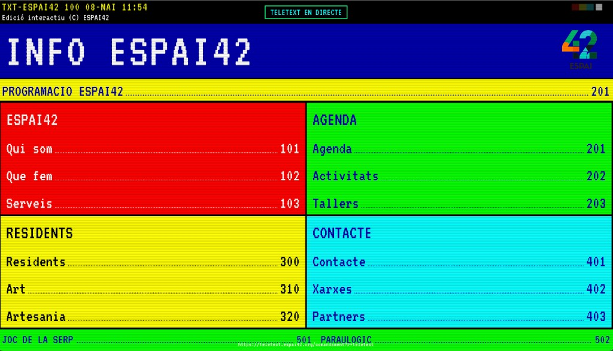

# Teletext Espai42



Projecte interactiu per a pantalla pública d'Espai42, amb estètica teletext clàssica, navegació amb comandament mòbil i contingut viu (jocs, xarxes socials i editor).

---

## CA · Català

### Què és i per què existeix?

`Teletext Espai42` és una experiència visual pensada per a escaparador i esdeveniments:

- actua com a pantalla principal amb identitat retro
- permet interacció directa des del mòbil (sense app)
- integra informació, jocs i xarxes socials en un format coherent amb la marca

L'objectiu és crear una peça de comunicació que siga:

- atractiva des del carrer
- fàcil d'usar en directe
- actualitzable sense tocar el codi en cada canvi de contingut

### Funcionalitats principals

- **Pantalla pública** a `/tv`
- **Comandament mòbil** a `/comandament`
- **Rutes alternatives** de compatibilitat (`/display`, `/pantalla`, `/remote`, `/mando`)
- **Control en temps real via WebSocket** (canvi de pàgina, controls de joc, presència remota)
- **Joc de la Serp** (pàg. `501`) amb records
- **Paraulògic comunitari** (pàg. `502`) amb records i diccionari extern
- **Carrusel d'Instagram** (pàg. `402`) amb estratègia de fallback
- **Editor de contingut** per actualitzar seccions i residents
- **Persistència de records** (snake i paraulògic)

### Arquitectura (resum)

- **Frontend:** React + Vite + React Router
- **Backend:** Node.js + Express
- **Temps real:** `ws` (WebSocket)
- **Procés en producció:** PM2
- **Reverse proxy:** Nginx

Estructura rellevant:

- `src/` interfície i components visuals
- `server/` API, WS, editor i lògica de backend
- `server/data/` contingut JSON editable
- `deploy/` configuració Nginx

### Contingut desacoblat del codi

- Diccionari Paraulògic: `paraulogic-words.json`
- Contingut editorial: `server/data/teletext-content.json`
- Cache manual Instagram (fallback temporal): `server/data/instagram-manual-cache.json`

### Editor de contingut (`/editor`)

L'editor permet gestionar contingut sense tocar el codi frontend:

- autenticació per usuari/contrasenya i token de sessió
- edició de seccions, residents, textos i pàgines
- pujada d'imatges que es publiquen a `/editor-assets/...`
- propagació de canvis en viu a pantalles connectades

Rutes API relacionades:

- `POST /api/editor/login`
- `GET /api/editor/content`
- `PUT /api/editor/content`
- `POST /api/editor/upload`
- `GET /api/editor/public-content`

### Entorn local

```bash
npm install
npm run dev
```

App disponible a `http://localhost:5173`.

### Variables d'entorn

- `NODE_ENV` (`development` o `production`)
- `PORT` (per defecte `5173`)
- `PUBLIC_BASE_URL` (ex. `https://teletext.espai42.org`)
- `IG_USER_ID` (opcional)
- `IG_ACCESS_TOKEN` (opcional)
- `IG_USERNAME` (opcional, per fallback públic)
- `IG_GUEST_FEED_URL` (opcional, fallback extern JSON)

### Deploy a VPS (PM2 + Nginx)

```bash
cd /var/www/teletext
npm ci
npm run build
pm2 startOrReload ecosystem.config.cjs --update-env
pm2 save
```

Plantilla Nginx:

- `deploy/nginx-teletext.conf`

```bash
cp deploy/nginx-teletext.conf /etc/nginx/sites-available/teletext
ln -s /etc/nginx/sites-available/teletext /etc/nginx/sites-enabled/teletext
nginx -t && systemctl reload nginx
```

SSL amb Let's Encrypt:

```bash
apt update && apt install -y certbot python3-certbot-nginx
certbot --nginx -d teletext.espai42.org
```

### Seguretat i manteniment

- No versionar secrets reals a fitxers de repo.
- Fer servir variables d'entorn al servidor.
- Revisar logs PM2 en incidències:

```bash
pm2 logs teletext
```

### Desenvolupat amb Cursor

Aquest projecte s'ha iterat i mantingut amb Cursor, aprofitant:

- mode Agent per refactors i canvis multi-fitxer
- context de codi i diagnòstic ràpid d'errors
- iteració assistida per IA sobre frontend/backend en paral lel

Model usat en aquest cicle de treball: **Codex 5.3** (via Cursor Agent).

### Llicència

Aquest projecte es distribueix amb llicència oberta **Creative Commons BY-NC 4.0** (ús no comercial).

- text legal resumit: `LICENSE`
- detalls oficials: [CC BY-NC 4.0](https://creativecommons.org/licenses/by-nc/4.0/)

### Fitxers estàndard de projecte

- Guia de contribució: `CONTRIBUTING.md`
- Política de seguretat: `SECURITY.md`
- Variables d'entorn exemple: `.env.example`

---

## ES · Castellano

### ¿Qué es y por qué existe?

`Teletext Espai42` es una experiencia visual para escaparate y eventos:

- funciona como pantalla principal con estética retro
- permite interacción directa desde móvil (sin app)
- integra información, juegos y redes sociales en un formato coherente con la marca

Objetivo:

- captar atención desde calle
- facilitar uso en directo
- permitir actualización de contenido sin tocar código en cada cambio

### Funcionalidades principales

- **Pantalla pública** en `/tv`
- **Mando móvil** en `/comandament`
- **Rutas alias** (`/display`, `/pantalla`, `/remote`, `/mando`)
- **Control en tiempo real por WebSocket**
- **Juego Snake** (página `501`) con récords
- **Paraulògic comunitario** (página `502`) con récords y diccionario externo
- **Carrusel de Instagram** (página `402`) con fallback
- **Editor de contenido** para secciones y residentes
- **Persistencia de récords**

### Arquitectura (resumen)

- **Frontend:** React + Vite + React Router
- **Backend:** Node.js + Express
- **Tiempo real:** `ws`
- **Proceso en producción:** PM2
- **Proxy inverso:** Nginx

Estructura clave:

- `src/` interfaz y componentes
- `server/` API, WS, editor y backend
- `server/data/` contenido JSON editable
- `deploy/` configuración de Nginx

### Contenido editable sin tocar código

- Diccionario Paraulògic: `paraulogic-words.json`
- Contenido editorial: `server/data/teletext-content.json`
- Cache manual Instagram (fallback temporal): `server/data/instagram-manual-cache.json`

### Editor de contenido (`/editor`)

El editor permite gestionar contenido sin tocar el frontend:

- autenticación con usuario/contraseña y token de sesión
- edición de secciones, residentes, textos y páginas
- subida de imágenes publicadas en `/editor-assets/...`
- propagación de cambios en vivo a pantallas conectadas

Rutas API relacionadas:

- `POST /api/editor/login`
- `GET /api/editor/content`
- `PUT /api/editor/content`
- `POST /api/editor/upload`
- `GET /api/editor/public-content`

### Desarrollo local

```bash
npm install
npm run dev
```

Disponible en `http://localhost:5173`.

### Variables de entorno

- `NODE_ENV` (`development` o `production`)
- `PORT` (por defecto `5173`)
- `PUBLIC_BASE_URL` (ej. `https://teletext.espai42.org`)
- `IG_USER_ID` (opcional)
- `IG_ACCESS_TOKEN` (opcional)
- `IG_USERNAME` (opcional, fallback público)
- `IG_GUEST_FEED_URL` (opcional, fallback externo JSON)

### Deploy en VPS (PM2 + Nginx)

```bash
cd /var/www/teletext
npm ci
npm run build
pm2 startOrReload ecosystem.config.cjs --update-env
pm2 save
```

Plantilla de Nginx:

- `deploy/nginx-teletext.conf`

```bash
cp deploy/nginx-teletext.conf /etc/nginx/sites-available/teletext
ln -s /etc/nginx/sites-available/teletext /etc/nginx/sites-enabled/teletext
nginx -t && systemctl reload nginx
```

TLS con Let's Encrypt:

```bash
apt update && apt install -y certbot python3-certbot-nginx
certbot --nginx -d teletext.espai42.org
```

### Seguridad y mantenimiento

- No subir secretos reales al repositorio.
- Usar variables de entorno en servidor.
- Revisar logs en caso de incidencia:

```bash
pm2 logs teletext
```

### Desarrollado con Cursor

Este proyecto se ha iterado y mantenido con Cursor, aprovechando:

- modo Agent para refactors y cambios multiarchivo
- contexto de código y diagnóstico rápido de errores
- iteración asistida por IA sobre frontend/backend en paralelo

Modelo usado en este ciclo de trabajo: **Codex 5.3** (vía Cursor Agent).

### Licencia

Este proyecto se distribuye bajo licencia abierta **Creative Commons BY-NC 4.0** (uso no comercial).

- texto legal resumido: `LICENSE`
- detalles oficiales: [CC BY-NC 4.0](https://creativecommons.org/licenses/by-nc/4.0/)

### Archivos estándar de proyecto

- Guía de contribución: `CONTRIBUTING.md`
- Política de seguridad: `SECURITY.md`
- Variables de entorno ejemplo: `.env.example`
